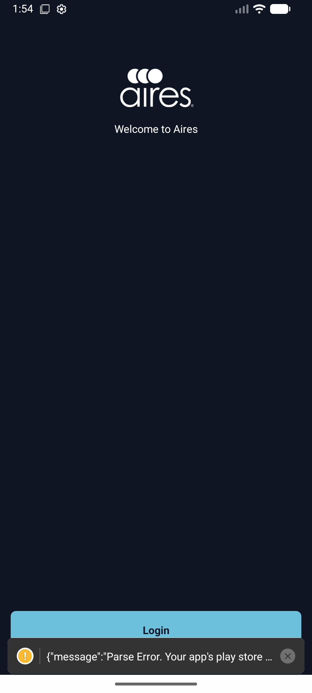
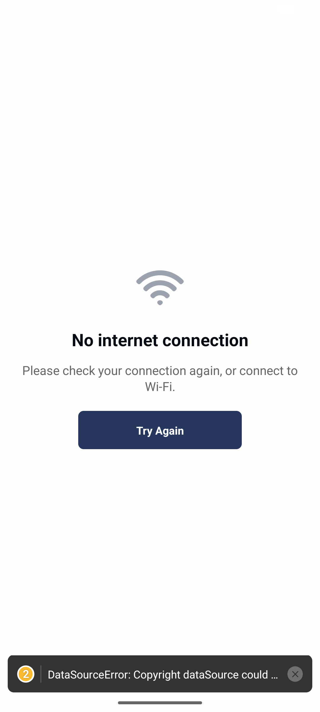
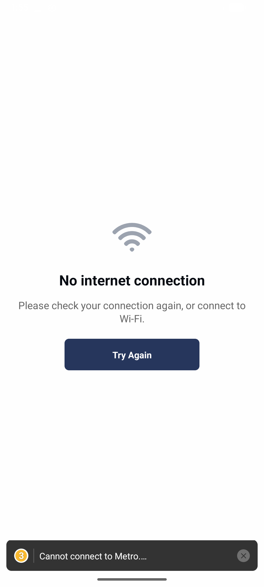
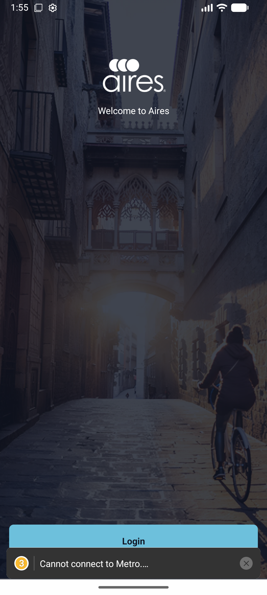
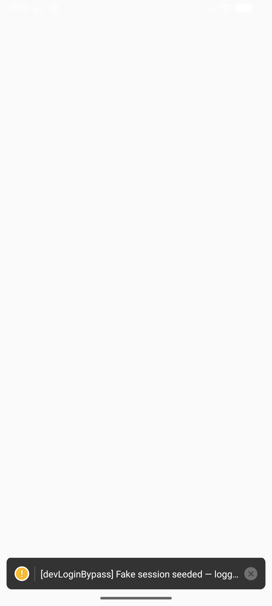
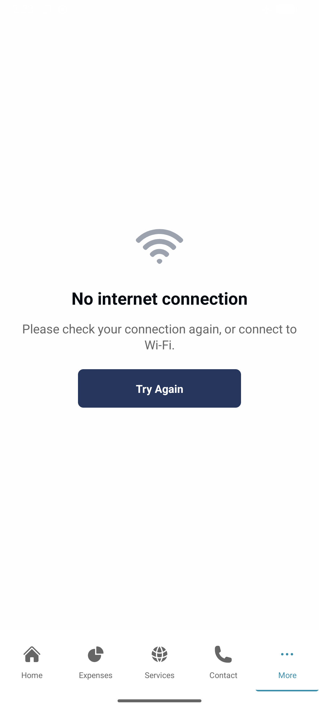
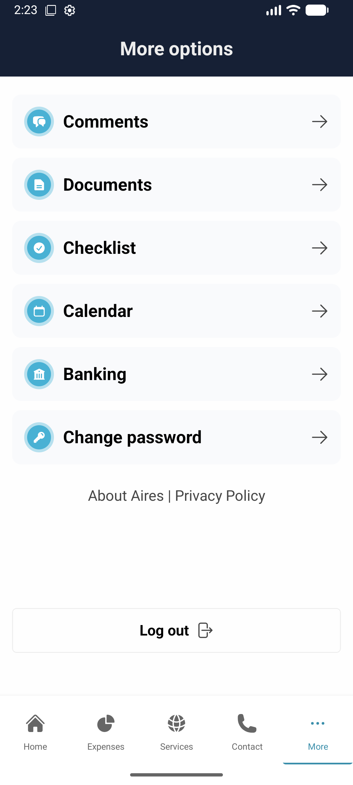
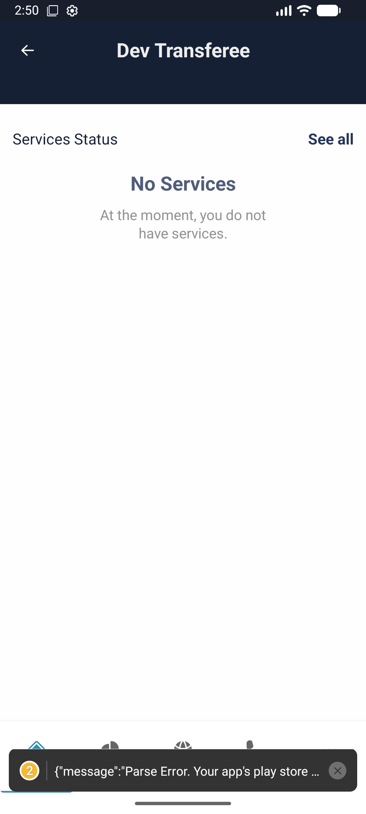
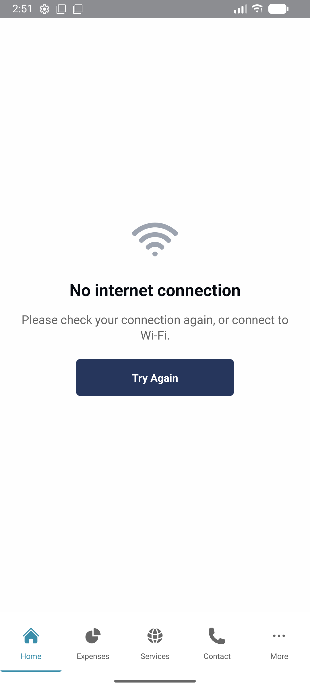
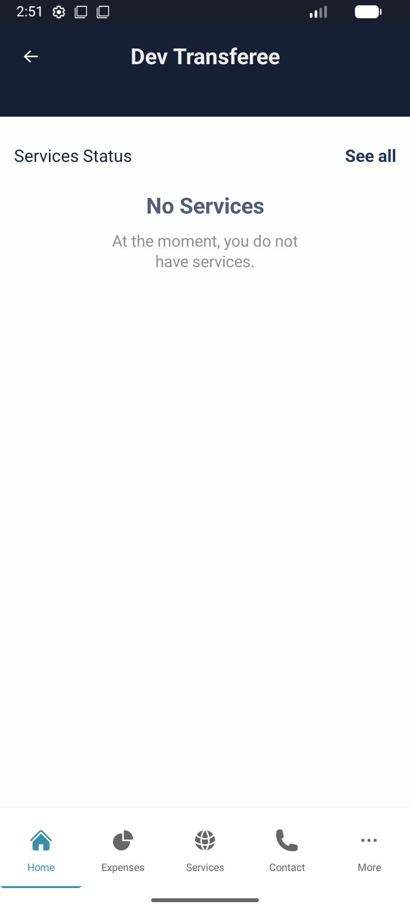

# AIR-544 — Global Network Check — "No internet connection" view

**AIR-544 · CR011 / v3.5.0 · Team Handoff**

What was built, what was tested, and the decisions behind it · for QA, Mayo, management & the team

| | |
|---|---|
| **Branch** | feature/AIR-544-network-check |
| **Commits** | 0df627f · eece2ec |
| **Estimate** | 8 h (billable) |
| **Status** | Implemented + QA'd locally · not pushed |
| **Date** | 2026-06-12 |

---

## ✅ Verdict — Feature works

**Verified across offline, logged-in & Wi-Fi-no-internet.**

A single global "No internet connection" view with a Try Again button. Detection is device-level (covers full offline *and* connected-Wi-Fi-without-internet). Pending: iOS check, working-tree cleanup, push/PR. Three scope decisions explained below.

---

## 1 · What was asked (the request)

A **billable, ~8-hour** request from Mayo: add a **network check**. In his words:

- Detect **no network** or **very slow network**.
- Show a **"No internet" empty state** with a **Try Again** button in the middle.
- Ideally **something global**, instanced across every view that makes a network request — "revisar si ya tenemos un networking layer robusto y meterlo en un solo lugar".
- Reference design: overlay over the visited view, **tabs still visible** — *"no estamos blocking toda la app"*. And: *"si eso es muy complicado, entonces un modal encima de todo y ya"*.

Jira: `AIR-544` · Release CR011 / v3.5.0 (Francisco's release, ships last after 3.3.1 & 3.4).

---

## 2 · What was built

A **single global gate** mounted once at the app root — no per-screen wiring. It hooks into the app's existing single networking choke point (`$fetch` + react-query) exactly as Mayo hoped.

- `src/hooks/network/useNetworkStatus.ts` — NetInfo subscription; debounced `isOffline` + `recheck()`. `deriveOffline()` covers full offline **and** Wi-Fi-connected-but-no-internet (`isInternetReachable === false`).
- `src/components/app/NetworkStatusGate.tsx` — wraps the navigator; renders the overlay offset by the tab-bar height while signed in (tabs stay visible), full-screen pre-login.
- `src/components/app/NoConnectionOverlay.tsx` — Wi-Fi icon + title + helper text + centered Try Again (i18n `noConnection.*`).
- `src/api/customFetch.ts` — 12 s `AbortController` per-request timeout (safety net so a hung request can't spin forever).
- `src/App.tsx` — mounts `NetworkStatusGate` once around `RootNavigator`. · `getIcon.ts` (+WifiIcon) · `en.json` (strings) · `netinfo ^11.5.2` dependency.

**One layout fix along the way (eece2ec):** the overlay first rendered at ~content height instead of full screen — a flex/percentage child of an absolute wrapper has no definite height in Yoga. Fixed with an explicit pixel height on the wrapper + `StyleSheet.absoluteFill` on the overlay.

---

## 3 · How it was tested (visual evidence)

### Before vs. After

| BEFORE / ONLINE | AFTER / OFFLINE |
|---|---|
|  |  |
| Previously, going offline gave only failed-request error toasts and no recovery path. | Now: a clear "No internet connection" view with Try Again. No silent failures. |

### Test 1 — Pre-login (offline → view → recover)

| 1 · Online — PASS | 2 · Offline — PASS | 3 · Restore — PASS |
|---|---|---|
|  |  |  |
| Feature invisible when connected. | Full-screen overlay (debounced ~1.5 s). | Overlay clears, back to login. |

### Test 2 — Logged-in (tab bar stays visible) · via dev bypass

Real staging login wouldn't work on the emulator (see Decision D), so a dev-only fake session was used to reach logged-in screens.

| 1 · Logged-in, online — PASS | 2 · Offline — PASS | 3 · Try Again — PASS |
|---|---|---|
|  |  |  |
| Tabs + empty states render. | Overlay over content; **all 5 tabs stay visible**. | Recovers the current view. |

### Test 3 — Wi-Fi connected, but no internet · key real-world case

The realistic failure: phone on Wi-Fi, but that Wi-Fi has no internet (router up / no WAN, captive portal). The device still says "connected", so this is the case that naïve checks miss — caught here by `isInternetReachable === false` (note the ⚠ on the Wi-Fi icon).

| 1 · Wi-Fi online — PASS | 2 · Wi-Fi, no internet — PASS | 3 · Restore + Try Again — PASS |
|---|---|---|
|  |  |  |
| Working internet, normal screen. | Wi-Fi connected (⚠) but unreachable → overlay. | Reachability returns, view recovers. |

### Results summary

| Scenario | Expected | Result |
|---|---|---|
| Builds & installs with NetInfo | Native module links, app runs | ✅ Pass |
| Offline (pre-login) | Full-screen "No internet" view | ✅ Pass |
| Logged-in (tabs stay visible) | Overlay over content, tab bar visible | ✅ Pass |
| **Wi-Fi connected, no internet** | Overlay appears (isInternetReachable=false) | ✅ Pass |
| Try Again (all cases) | Re-checks connectivity, recovers view | ✅ Pass |
| No cold-start flash | No false overlay while loading online | ✅ Pass |
| Lint / typecheck | No new errors | ✅ Pass |
| iOS | Same behavior on iOS | ⚠️ Not tested (Decision E) |

---

## 4 · Decisions made this session (and why)

> This was an **8-hour** task. The goal was a single, global, robust check — **not** an exhaustive offline-first overhaul. Each decision below was a conscious trade-off to keep the feature correct and safe within that scope. Several came directly out of questions raised during review.

**A · Scope = device-level connectivity, one global gate.**
The whole feature is driven by one signal (NetInfo says the device has/hasn't usable internet) and one component mounted at the app root. It hooks the existing `$fetch` layer rather than touching ~40 screens individually. This is what made an 8 h delivery realistic and matches Mayo's "algo muy global, en un solo lugar".

**B · "Slow network" is NOT wired to the global overlay.**
A request timeout is **per-request**: one endpoint can be slow while everything else works. Blanking the whole app because a single request was slow is the exact "don't block the app" problem we want to avoid. So the 12 s timeout stays a **per-request safety net** (handled locally by the screen), not a global takeover. "Slow but alive" (e.g. 3G) is intentionally not flagged — the app stays usable for reads. The genuinely valuable "no real internet" case is device-wide and is covered by NetInfo instead (Test 3).

**C · "Tabs stay visible" is kept, but it is cosmetic — open for Mayo.**
Built per the reference design. Honest caveat: because detection is device-level, when offline *every* tab is equally dead — tapping another tab just shows the same overlay. So visible tabs are **reassurance, not function** ("the app is fine, the network isn't"). Mayo pre-approved the simpler fallback (*"un modal encima de todo y ya"*). A **full-screen overlay would be simpler and less fragile** (the tab-bar-height offset is the one piece that already needed a layout fix). **No functional difference — Mayo's call.**

**D · Logged-in screens tested with a dev-only login bypass.**
Real staging login wouldn't complete on the local emulator (credentials/backend, **not** the network — staging hosts resolve and respond fine; the failing ICMP ping is just the AWS load balancer blocking pings). To verify logged-in behavior anyway, a `__DEV__`-gated bypass seeded a fake session and short-circuited authenticated calls. **It is never committed to the feature branch** — it lives on a separate local branch (`local/AIR-544-dev-login-bypass`) for reuse. QA on a real device/build won't need it.

**E · iOS not tested locally.**
Verifying iOS needs `pod install` (Ruby 3.1.2 not installed on this machine). The code is cross-platform (NetInfo + RN primitives, no platform-specific paths), so behavior is expected to match — but **iOS should be confirmed by QA on a build** before sign-off.

**F · `copyright.ts` left as a raw `fetch` (a Jira AC item, intentionally skipped).**
The ticket suggested folding the one stray raw `fetch` into `$fetch`. But `getCopyright()` is a public, cosmetic, **pre-login** call — routing it through `$fetch` would attach an empty auth header and, on a 401, trigger the token-refresh → logout path. Auth side effects on a public endpoint, for zero gain (footer text; the URL is currently empty). Left as-is by design.

---

## 5 · Known gaps / for product to decide

| Gap | Impact | Fix if wanted |
|---|---|---|
| **Cold-launch while offline** | The overlay fires on a *live* online→offline transition. Launching the app when *already* offline shows nothing until connectivity changes. | Add an initial `NetInfo.fetch()` on mount in `useNetworkStatus` (~small). |
| **Tabs visible vs. full-screen** | Cosmetic (Decision C). Currently tabs visible. | Mayo decides; full-screen is a tiny simplification if preferred. |
| **iOS** | Untested locally (Decision E). | QA confirms on an iOS build. |

---

## 6 · Status & next steps

| Item | Status |
|---|---|
| Code implementation (9 files) | ✅ Done · 0df627f, eece2ec |
| Lint / typecheck | ✅ Clean (0 new errors) |
| Local QA — offline / logged-in / Wi-Fi-no-internet | ✅ Verified (this doc) |
| Design review (scope decisions) | ✅ Done (§4) |
| Working tree clean of dev bypass | ✅ Done — bypass saved on local branch |
| iOS | ⚠️ Pending QA |
| Push / PR / Jira move | ❌ Not done |

**Next steps (in order)**

1. Mayo: confirm **tabs-visible vs. full-screen** (Decision C) and whether **cold-launch-offline** matters (§5).
2. Push `feature/AIR-544-network-check` → open PR to `develop`.
3. QA: verify on a real build, both platforms (esp. **iOS**).
4. Move AIR-544 forward in Jira; attach this handoff.

> **Dev bypass is safe.** The scaffolding used for Test 2 is committed only to the local branch `local/AIR-544-dev-login-bypass` and is **not** part of the feature branch or any PR. The feature branch contains only the two real commits.

---

## 7 · Release context

**Release order:** v3.3.1 (AIR-537, blocked on client + prod creds) → v3.4 (Erika's tickets) → **v3.5 / CR011 (Francisco's AIR-539 / 540 / 541 / 544)** — ships last.

**Sibling tickets:** AIR-540 (#137, env) — awaiting review · AIR-541 (#139, dynamic version) — in QA · AIR-539 (#134, RN 0.81) — QA passed.

---

*AIR-544 · Self-contained team handoff (QA · Mayo · management · team) · staging build, no production data accessed · 2026-06-12*
