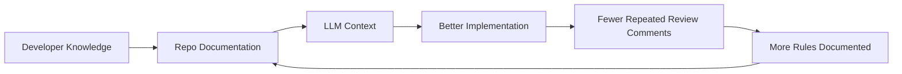
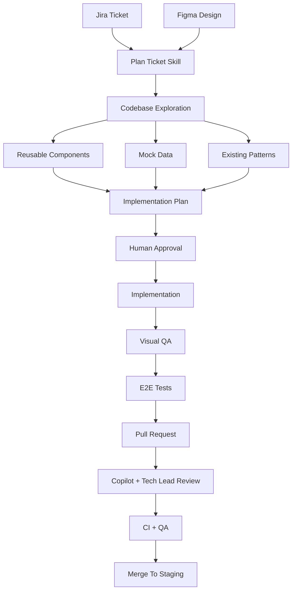
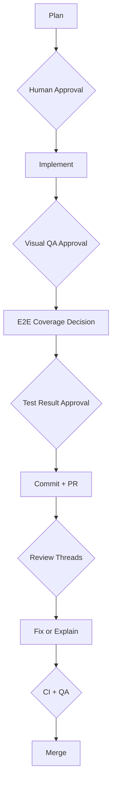

# The Real Secret Behind AI Automation Is Developer Documentation

Many teams think AI automation starts with a better prompt.

After working with the TD Bank App Web project, I think the real answer is different:

**AI automation starts with developer documentation.**

Not product documentation only. Not Jira only. Not Figma only. Those are necessary inputs, and in a healthy product workflow we assume they are good. But they are not enough.

The reason a project like TD Bank App Web can reach a high level of automation is that the development team has documented how engineering work should happen:

- how tickets are planned
- how Figma should be interpreted
- which components should be reused
- when to create new components
- how pull requests are created
- how reviews are handled
- which code patterns are preferred
- which decisions have already been made
- where tests live
- when a human must approve the next step

That documentation turns an LLM from a generic code generator into something much closer to a project-aware engineering assistant.

## The Core Idea



The loop is simple:

1. Developers document how the team works.
2. The LLM reads that documentation.
3. The LLM makes better implementation decisions.
4. Human reviewers repeat themselves less.
5. Any repeated review feedback becomes new documentation.
6. The next LLM session starts smarter.

That is the compounding effect.

## TD Bank As A Case Study

In the TD Bank App Web repo, the AI workflow is not just "read Jira and code." It has a system.

A ticket can go through a documented path:



That path is documented in project-specific workflow files and skills kept in the TD Bank App Web repo:

| Skill | Purpose |
| --- | --- |
| [`workflow`](https://github.com/koombea/td-bank-app-web/blob/main/.claude/skills/workflow/SKILL.md) | Full ticket-to-merge process with human checkpoints |
| [`plan-ticket`](https://github.com/koombea/td-bank-app-web/blob/main/.claude/skills/plan-ticket/SKILL.md) | Converts Jira + Figma into a structured implementation plan |
| [`create-component`](https://github.com/koombea/td-bank-app-web/blob/main/.claude/skills/create-component/SKILL.md) | Component reuse guide and creation checklist |
| [`frontend-quality-rules`](https://github.com/koombea/td-bank-app-web/blob/main/.claude/skills/frontend-quality-rules/SKILL.md) | Code consistency rules extracted from recurring review feedback |
| [`pr`](https://github.com/koombea/td-bank-app-web/blob/main/.claude/skills/pr/SKILL.md) | PR creation rules (target branch, title format, description) |
| `rhonalf-review` | Tech-lead review rules encoded so the agent pre-reviews before humans |

> The actual skill content lives in the TD Bank repo. This document describes the pattern, not the specific rules.

## The Documentation Stack That Makes Automation Work

| Layer | What To Document | Why It Helps AI |
| --- | --- | --- |
| Workflow | Full ticket-to-merge cycle, human checkpoints | Tells the agent the process and where to stop |
| Planning | How to read tickets, extract Figma, explore codebase | Separates planning from implementation |
| Components | Existing components, when to reuse vs. create | Prevents duplication, encourages composition |
| Frontend rules | Navigation, semantics, JSX style, naming | Makes small decisions consistent |
| Review rules | Recurring tech lead feedback | Pre-encodes review taste so it doesn't repeat |
| PR rules | Branch, commit, title, description format | Reduces delivery friction |
| Project agents | Expert, reviewer, UI planner, security | Gives LLM specialized perspectives |
| Saved plans | Previous ticket plans in `.claude/plans/` | Creates institutional memory from past work |
| Architecture docs | Routes, data models, deployments | Prevents incorrect assumptions |
| Business logic | Simulator constraints, navigation patterns, mock rules | Connects product intent with code |
| Testing docs | Page Object conventions, when tests are required | Makes validation repeatable |

This is the real AI workflow: not one prompt, but a documented operating system for the project.

## The Workflow Is A Product

The strongest artifact in the TD Bank repo is the workflow documentation.

It documents the full ticket-to-merge cycle and — critically — it defines human checkpoints.



AI automation without checkpoints can create risk. AI automation with documented checkpoints creates leverage.

The human is still in the loop, but the human does not need to manually guide every small decision. The workflow already tells the agent when to stop and what to present.

## The `plan-ticket` Skill Is A Blueprint

The `plan-ticket` skill separates planning from implementation. The agent does not jump directly into code. It first creates a plan that includes:

- context and scope
- files to modify or create
- reusable components to use
- implementation steps
- mock data requirements
- testing plan
- manual QA checklist

That plan is written to `.claude/plans/<ticket>/plan.md` and becomes shared memory — a future session can read it and continue without starting from zero.

The shape of a good plan:

```markdown
# TDB-XXX: Feature Name

## Context
Why this change is needed.
Which personas and platforms are affected.
Which Figma file or screenshot is the source of truth.

## Files to Modify/Create
| File | Action | Description |
| --- | --- | --- |
| `src/app/[persona]/[platform]/feature/page.js` | Create | New screen |
| `src/app/components/ExistingComponent.js` | Modify | Add backward-compatible prop |

## Reusable Components
- `NotchMenu` — shared mobile header
- `BottomSheetModal` — reusable bottom sheet

## Implementation Steps
1. Create the route.
2. Reuse the shared header.
3. Wire mock data.
4. Add disabled and active states.
5. Verify iOS and Android variants.

## Testing
- Visual QA for iOS and Android
- E2E happy path
- Disabled state check
```

## Components Are Automation Infrastructure

Reusable components are one of the biggest reasons this repo works well with AI.

When a repo has documented components, the LLM can build screens by composition instead of invention. The less it invents, the less humans need to review.

**Bad pattern — inventing instead of reusing:**

```jsx
function CustomDirectDepositCard() {
  return (
    <div className="rounded-lg bg-white p-4">
      <p className="font-bold">Direct deposit</p>
      <p>Set up payroll deposits</p>
    </div>
  );
}
```

**Better pattern — composing with existing components:**

```jsx
<LinkBox
  title="Direct deposit"
  description="Set up payroll deposits"
  iconName="dollarsign-bank-building"
  link={`/${persona}/${platform}/direct-deposit`}
/>
```

The second version reuses existing styling, spacing, accessibility, and navigation behavior.

## Review Rules Encode Team Taste

Every team has preferences that usually live in people's heads.

In TD Bank App Web, many of those preferences are documented. The frontend quality rules document rules like:

- use `Link` instead of `router.push()` for simple internal navigation
- remove unnecessary DOM wrappers
- avoid trivial helper functions
- avoid redundant elements inside links and buttons
- preserve backward compatibility
- keep JSX concise

This is exactly the kind of documentation that makes AI useful.

**Example: `Link` vs. `router.push()`**

In a normal repo, an LLM might guess whether to use `router.push()` or `Link`. In this repo, the answer is documented.

```jsx
// Before
import { useRouter } from 'next/navigation';
const router = useRouter();
<button onClick={() => router.push('/direct-deposit/quick-setup')}>Continue</button>

// After
import Link from 'next/link';
<Link href="/direct-deposit/quick-setup">Continue</Link>
```

If a reviewer says the same thing three times, it should become a rule.

## Business Logic Patterns Are Also Developer Documentation

Developer documentation should not only explain components and commands. It should explain the product logic that makes the app behave the way it does.

For TD Bank App Web, that means documenting:

- the app uses mock data instead of live banking services
- flows are built for demos, QA, and scenario coverage
- personas and platforms are part of the route structure
- navigation must preserve simulator context so the user returns to the expected demo state

A useful repo note might look like this:

```markdown
## Product Intent

This project is a mobile banking simulator. It is not a production banking app.

Implementation should preserve demo fidelity, persona-specific scenarios,
platform-specific UI behavior, and mock data flows. Do not introduce real
banking integrations unless a ticket explicitly asks for it.
```

That small paragraph prevents a large class of wrong assumptions.

## Feedback Fixes Are Where The System Proves Itself

Planning a new ticket is one test. Fixing QA feedback on a shipped feature is another.

Feedback fixes feel small, but they require the agent to:

- understand which screen is affected and why
- locate the right file among dozens of similar routes
- know the icon system well enough to add a new one correctly
- know the interaction conventions well enough to spot a gating logic mistake
- follow the right delivery path (new branch from stg, cherry-pick, PR targeting stg)

Without project documentation, each of those steps becomes a question for the developer. With it, the agent can navigate all of them.

**Example: Swapping An Icon (TDB-673)**

QA feedback: the recurring icon on the Netflix merchant row looked different than expected. The current implementation used a generic heroicons arrow. The expected icon was a custom SVG from the design system.

The `add-icon` skill documented exactly how to handle this: clean the SVG, wrap in a `<symbol>`, add to the sprite, register in the preview page, use the `Icon` component.

```jsx
// Before
import { ArrowPathIcon } from '@heroicons/react/24/outline';
{merchant.recurrent && <ArrowPathIcon className="w-4 h-4 text-green-600" />}

// After
import Icon from '@/components/Icons';
{merchant.recurrent && <Icon name="merchant-recurring" size={16} color="#16a34a" />}
```

Total decision-making by the developer: approve the output. The documentation did the rest.

**Example: Removing A Gating Logic Mistake (TDB-677)**

QA feedback: the Continue button was not clickable unless the checkbox was checked. Acceptance criteria said it should always be active.

Because the frontend quality rules documented that `Link` is the right element for simple navigation, the fix was clear: remove the gating, keep the `Link`, clean up unused `aria-disabled`.

```jsx
// Before — gated on checkbox state
<Link href={...} aria-disabled={!isChecked} className={`... ${isChecked ? '' : 'opacity-40 pointer-events-none'}`}>
  Continue
</Link>

// After — always active
<Link href={...} className="block w-full bg-green-600 text-white text-base font-medium py-3 text-center">
  Continue
</Link>
```

Neither fix required explaining context to the agent. The documentation already contained the context.

## What Other Projects Should Add To Their AI Workflow

A template other teams can copy:

### 1. A Full Workflow Document

Document the complete path from ticket to merge — planning, implementation, local QA, tests, commits, PR, review, CI, staging, release. Also document where the AI must stop for human approval.

### 2. A Ticket Planning Skill

Create a repeatable process for turning a Jira ticket into a plan: read ticket, read comments, inspect attachments, parse Figma, explore codebase, find reusable components, write a structured plan, list open questions.

### 3. A Component Reuse Guide

Document existing components, when to use each one, when to enhance instead of create, prop conventions, examples, and where component docs live. This is one of the highest-value investments.

### 4. Frontend Quality Rules

Write down the rules reviewers keep repeating: navigation patterns, semantic HTML, accessibility, JSX style, URL handling, naming conventions, state management preferences.

### 5. Review Persona Or Tech Lead Rules

Capture how the tech lead reviews. Document recurring review comments from your senior engineers so the agent pre-reviews before the human does.

### 6. PR And Commit Rules

Document branch naming, commit message format, PR title format, target branch, PR description structure, required checks, and what not to include.

### 7. Testing Rules

Document when tests are required, where tests live, naming conventions, page object patterns, how to run tests, and what coverage is expected.

### 8. Architecture And Data Docs

Document source tree, key routes, mock API structure, data models, integration points, known technical debt, and deployment configuration.

### 9. Business And App Logic Pattern Docs

Document the rules that connect product intent with implementation: what the app is and is not, core domain rules, navigation behavior, mock data boundaries, scenario examples.

### 10. Saved Plans And Examples

Keep previous ticket plans in the repo. They become examples for future automation. Every completed ticket is a reusable reference.

### 11. Human Checkpoints

Document where humans must approve: plan, open questions, screenshots, E2E scope, test result, commit message, PR description, review decisions.

Automation should reduce human work, not remove human judgment.

## The Best AI Workflow Is A Documented Team Workflow

The TD Bank App Web repo works well with AI because the team has already done the hard engineering work of documenting how the project should be built.

The Jira ticket and Figma design explain **what** to build.

The developer documentation explains **how** to build it.

That is the difference.

A good AI workflow is not only a prompt. It is a collection of project knowledge: skills, agents, component docs, architecture docs, review rules, workflow checkpoints, saved plans, testing conventions, PR conventions, and previous decisions.

When those things are documented, each new LLM session can start with real context. It can take the Jira ticket, read the Figma, inspect the repo documentation, reuse components, follow project decisions, and produce an implementation that is much closer to what the team expects.

That is how human work goes down over time.

Not because humans stop reviewing.

Because humans stop repeating themselves.
